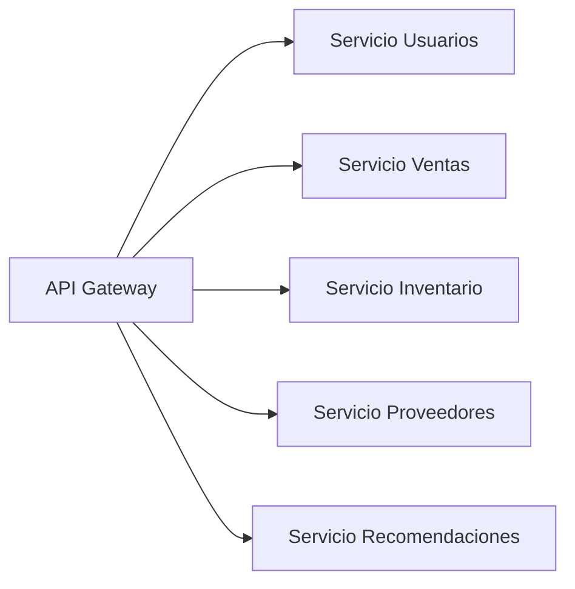

# Documento de Arquitectura General (Backend)

Fecha de entrega: 04 de agosto de 2025

## 1. Visión general

Este documento describe la arquitectura general del backend, contemplando los microservicios de:
- Usuarios
- Ventas
- Inventario
- Proveedores
- Recomendaciones

Cada microservicio es independiente, expone una API REST y tiene su propia base de datos o esquema. Se integran mediante un API Gateway y un sistema de autenticación centralizado.

### Diagrama de la arquitectura



## 2. Reestructuración de Carpetas

Estructura monorepo (root):
```
/ (workspace)
│
├─ /services
│   ├─ /users-service
│   ├─ /sales-service
│   ├─ /inventory-service
│   ├─ /suppliers-service
│   └─ /recommendations-service
│
├─ /libs
│   ├─ /auth
│   ├─ /shared-models
│   └─ /utils
│
├─ /gateway
│   └─ API Gateway (Express/Koa)
│
├─ /.github
│   └─ workflows CI/CD
│
├─ /docs
│   └─ swagger.yaml / OpenAPI spec general
│
└─ README.md
```

## 3. API REST Principales

Cada servicio seguirá convenciones RESTful:

### Users Service (/services/users-service)
- POST   /api/users/register
- POST   /api/users/login
- GET    /api/users/profile
- ... (roles, password reset, verify)

### Sales Service (/services/sales-service)
- POST   /api/sales
- GET    /api/sales
- GET    /api/sales/:id
- PUT    /api/sales/:id
- DELETE /api/sales/:id

### Inventory Service (/services/inventory-service)
- POST   /api/inventory
- GET    /api/inventory
- GET    /api/inventory/:id
- PUT    /api/inventory/:id
- DELETE /api/inventory/:id

### Suppliers Service (/services/suppliers-service)
- POST   /api/suppliers
- GET    /api/suppliers
- GET    /api/suppliers/:id
- PUT    /api/suppliers/:id
- DELETE /api/suppliers/:id

### Recommendations Service (/services/recommendations-service)
- GET    /api/recommendations?userId=

## 4. Autenticación y Sesiones

- **Gateway** valida JWT enviado en encabezados `Authorization: Bearer <token>`.
- **Auth Library (/libs/auth)**: emisión de tokens, middleware de protección, roles.
- **Refresh Tokens**: opcional, endpoint `/api/auth/refresh`.
- Al iniciar sesión, se genera JWT (acceso corto) y refresh token (largo).

## 5. CI/CD y Docker

- Pipelines GitHub Actions para lint, test y build de cada servicio.
- Docker Compose para ambientes locales.
- Despliegue en Kubernetes o ECS con servicios independientes.

---

## 6. Comparación de tecnologías

| Criterio               | Tecnología elegida     | Alternativa           | Justificación                                                  |
|------------------------|------------------------|-----------------------|---------------------------------------------------------------|
| Framework              | Express                | Koa, Fastify          | Ecosistema maduro, middleware estándar y comunidad activa.    |
| ODM/ORM                | Mongoose               | Sequelize             | Integración nativa con MongoDB y flexibilidad en esquemas.    |
| Base de datos          | MongoDB                | PostgreSQL            | Modelo de documentos ideal para datos semi-estructurados.     |
| Autenticación          | JWT (jsonwebtoken)     | OAuth2, sesiones      | Stateless y escalable, fácil en microservicios.               |
| Pruebas E2E            | Cypress                | Playwright            | API de alto nivel y buen soporte de interacciones.            |
| Documentación de APIs  | Swagger (OpenAPI)      | Postman Collections   | Estándar abierto, generación automática y UI interactiva.     |

> Esta propuesta sirve de base para implementar la nueva estructura y definir los entregables de cada servicio.
